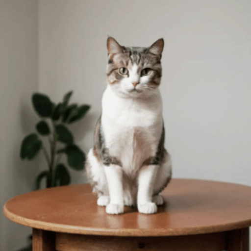
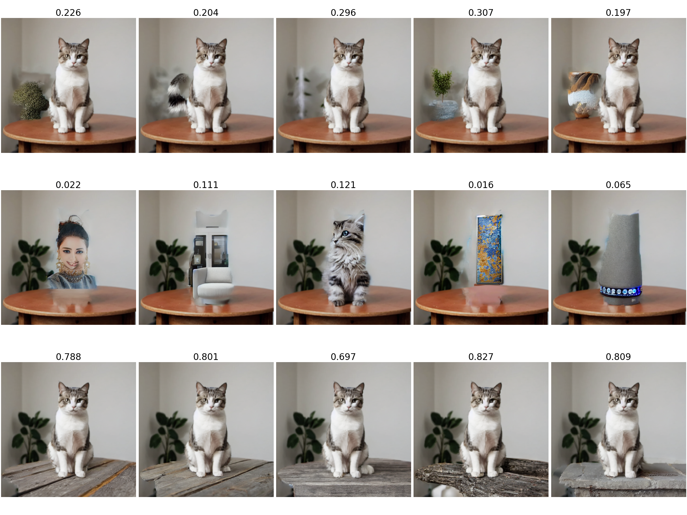

# Visual-Jenga-Reimplementation

Reproduction of Visual Jenga (https://visualjenga.github.io/) in PyTorch.

## How to use:

The following command takes in an image filepath and generates a series of images that should naturally take apart the scene in a physically plausible way

`python generate_sequence.py assets/books.png --prompt "point to all books in the image"`

Sample outputs after concatenating images as gifs:

The following command takes in an image filepath and generates something similar to figure 2 of the paper:

`python visual_jenga.py assets/cat.png --prompt "point to objects in the image, both animals and furniture"`

## Differences between the paper and this implementation:

- I'm just using DINO, the actual paper uses CLIP too. There are also other similarity options

- The paper uses Adobe Firefly, which isn't open source. I use Attentive Eraser instead (https://github.com/Anonym0u3/AttentiveEraser). It works sometimes, but not as good as what's shown in the paper.

- You need to provide molmo a image-specific prompt, like "point at all books". It'll require a bit of prompt tuning before getting a good decomposition. Ideally there should be one prompt that works for all images. 